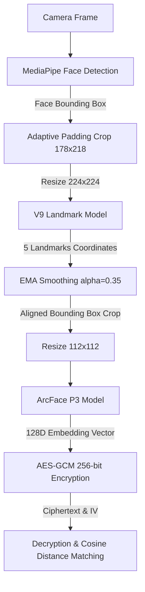

# Báo Cáo Thử Nghiệm Và Tích Hợp Mô Hình Nhận Diện Khuôn Mặt V9 & ArcFace P3

## 1. Tổng quan
Báo cáo này tóm tắt quá trình tích hợp và thử nghiệm hiệu năng của hai mô hình mới: **V9 Landmarks** (phát hiện điểm mốc) và **ArcFace P3** (trích xuất đặc trưng nhận dạng) nhằm thay thế giải pháp nhận diện khuôn mặt cũ sử dụng mô hình **SFace (FP32 & INT8)** trong dự án nhận dạng khuôn mặt bảo mật qua AES-GCM.

---

## 2. Kết quả kiểm thử hiệu năng (Benchmark)
Thử nghiệm hiệu năng được đo đạc tự động trên cả hai môi trường:
1. **Python (Offline CPU)**: Chạy thông qua thư viện `onnxruntime` trên máy tính cục bộ.
2. **Web Browser (WASM)**: Chạy thông qua thư viện `onnxruntime-web` (WebAssembly) trực tiếp trên trình duyệt.

### Bảng so sánh chi tiết:

| Tên mô hình | Kích thước đầu vào | CPU Python Latency (ms) | CPU Python FPS | WASM Browser Latency (ms) | WASM Browser FPS |
| :--- | :---: | :---: | :---: | :---: | :---: |
| **SFace (FP32)** | `[1, 3, 112, 112]` | 13.06 | 76.6 | 54.33 | 18.4 |
| **SFace (INT8)** | `[1, 3, 112, 112]` | 62.23 | 16.1 | 403.44 | 2.5 |
| **V9 Landmarks** | `[1, 3, 224, 224]` | **2.70** | **371.0** | **59.05** | **16.9** |
| **ArcFace P3** | `[1, 3, 112, 112]` | **6.39** | **156.4** | **80.03** | **12.5** |

### Đánh giá hiệu năng:
* **Hiệu năng của ArcFace P3**: Trên môi trường CPU Python, ArcFace P3 đạt hiệu năng vượt trội với tốc độ xử lý nhanh hơn gấp đôi so với SFace FP32 (6.39 ms so với 13.06 ms). Trên trình duyệt, ArcFace P3 đạt tốc độ 80.03 ms (~12.5 FPS) phù hợp cho các tác vụ nhận diện liên tục.
* **Tốc độ của V9 Landmarks**: Mô hình phát hiện điểm mốc hoạt động cực kỳ nhẹ và nhanh, chỉ mất 2.70 ms trên Python CPU và 59.05 ms trên môi trường WASM của trình duyệt.
* **Vấn đề của SFace (INT8)**: Mô hình lượng hóa INT8 cho tốc độ rất chậm trên cả hai môi trường (62.23 ms trên Python, 403.44 ms trên WASM) do tập lệnh và thư viện chạy trên CPU thông thường chưa được tối ưu hóa phần cứng tốt cho các toán tử lượng hóa.

---

## 3. Kiến trúc tích hợp (Two-Pass Pipeline)
Luồng xử lý nhận dạng thời gian thực trên giao diện Web đã được tái cấu trúc hoàn toàn để tương đồng với mã nguồn chạy trên thiết bị phần cứng (MaixCAM):

### Các cải tiến kỹ thuật chính:
1. **Adaptive Padding & Alignment**: Căn chỉnh khuôn mặt bằng cách xác định trọng tâm và tỷ lệ khoảng cách của 5 điểm mốc được dự đoán từ V9. Điều này khắc phục hạn chế của việc crop trực tiếp từ hộp bao MediaPipe, giúp nâng cao độ chính xác khi so khớp.
2. **Bộ lọc EMA (Exponential Moving Average)**: Áp dụng công thức làm mịn $EMA_{new} = 0.35 \times L_{new} + 0.65 \times EMA_{prev}$ lên tọa độ điểm mốc khuôn mặt giúp triệt tiêu hiện tượng rung lắc (jittering) trên luồng camera thời gian thực.
3. **Khớp mã hóa an toàn**: Kết quả đầu ra 128 chiều từ ArcFace P3 được mã hóa thành dạng mật mã qua khóa đối xứng AES-GCM trước khi truyền qua kênh giải mã đối sánh. Khoảng cách đối sánh được tính bằng `Cosine Distance = 1.0 - Cosine Similarity` với ngưỡng nhận dạng khớp cực kỳ nhạy (`<= 0.045`).

---

## 4. Giao diện người dùng cải tiến
Giao diện `index.html` được thiết kế lại toàn bộ với phong cách **Cyberpunk Dark-UI**:
* Sử dụng bảng màu tối sang trọng kết hợp các hiệu ứng viền phát sáng neon (Electric Blue, Emerald Green).
* Tích hợp bảng thử nghiệm hiệu năng WASM trực tiếp giúp người dùng chạy kiểm thử các mô hình ngay trên giao diện web bằng một nút bấm.
* Các vùng hiển thị dữ liệu mật mã (IV, Ciphertext) dạng terminal tạo cảm giác công nghệ cao và chuyên nghiệp.
